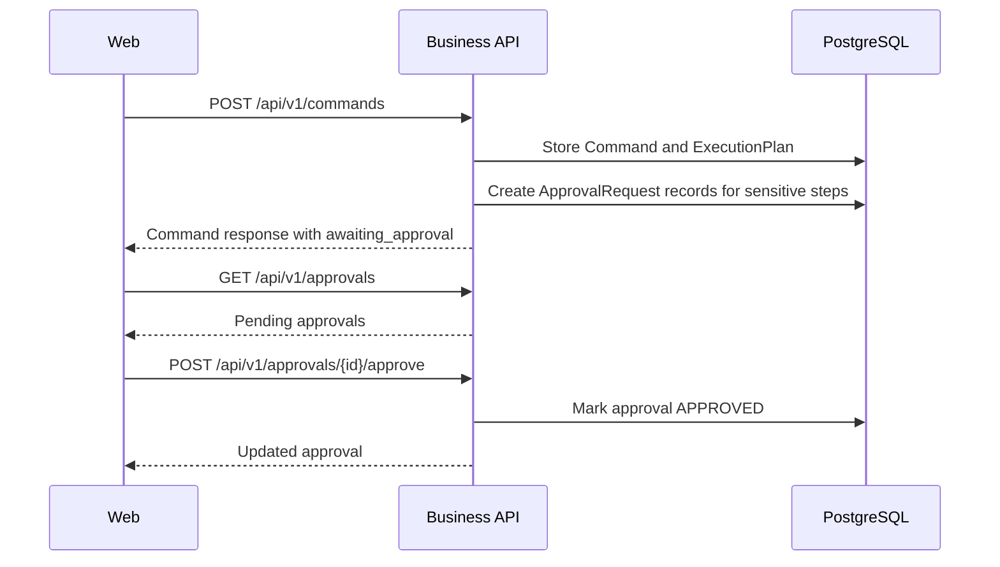

# Approval Workflow Implementation Plan

## Purpose

This plan defines the next safety-critical slice after the MCP Capability Registry: explicit founder approval requests for planned actions that require human confirmation.

FAIOS must never silently execute sensitive actions. Calendar changes, outbound communication, destructive actions, and future payment-like operations need a visible approval gate before real MCP execution is introduced.

## Product Slice

```text
Founder submits command
  -> AI planner returns steps
  -> Business API persists plan
  -> Approval-required steps create ApprovalRequest records
  -> Web app displays pending approvals
  -> Founder can approve or reject
  -> Command remains planned-only; no MCP execution yet
```

## Non-Goals

- No real MCP execution
- No OAuth or provider API calls
- No notification delivery
- No background workers
- No multi-user approval routing
- No voice approval yet

## Success Criteria

- Approval-required plan steps create `ApprovalRequest` records.
- Business API exposes pending approvals for the development founder.
- Business API supports approve/reject transitions.
- Web app displays pending approvals.
- Web app lets the founder approve or reject.
- Approving does not execute tools yet.
- All responses use correlation IDs and standard errors.
- Checks pass.

## Architecture



## Data Model

Use existing `ApprovalRequest`:

- `id`
- `commandId`
- `reason`
- `payload`
- `status`
- `requestedAt`
- `resolvedAt`

No new Prisma tables are required for this slice.

Payload should include:

- `capability`
- `provider`
- `reason`
- `commandSummary`

## Shared Contracts

Add schemas to `@faios/contracts`:

- `approvalStatusSchema`
- `approvalRequestSchema`
- `listApprovalsResponseSchema`
- `approvalDecisionResponseSchema`

Statuses:

- `pending`
- `approved`
- `rejected`
- `expired`

## Business API

Expected folders:

```text
services/business-api/src/features/approvals/
  application/
    list-approvals.use-case.ts
    decide-approval.use-case.ts
  infrastructure/
    approval.repository.ts
  presentation/
    approval.routes.ts
  index.ts
```

Endpoints:

```http
GET /api/v1/approvals
POST /api/v1/approvals/{approvalId}/approve
POST /api/v1/approvals/{approvalId}/reject
```

Command pipeline change:

- `CommandRepository.storePlan` should create approval requests for steps with `requiresApproval=true`.
- It should keep command status as `AWAITING_APPROVAL` when any approval is required.
- It should not execute tools after approval yet.

## Web App

Expected folders:

```text
apps/web/src/features/approvals/
  api/
  components/
  hooks/
  types/
  index.ts
```

UI behavior:

- Show pending approvals below the command composer.
- Each approval shows capability, provider, reason, command summary, and requested time.
- Approve and Reject buttons are explicit and disabled during mutation.
- Refresh approvals after a command is submitted and after a decision.

## Reliability

- Approval decisions must be idempotent from the founder's perspective.
- Rejecting an approval must never execute tools.
- Approving all approvals should not execute tools in this slice.
- Future execution workers can pick up approved commands later.

## Security

- Only development founder approvals are visible in this phase.
- Never expose provider credentials.
- Never include raw secrets in approval payload.
- Require explicit POST for approve/reject.

## Testing

Required checks:

- Contract typecheck
- Business API typecheck/lint
- Web typecheck/lint/build
- Full monorepo format/lint/typecheck/test/build

Runtime smoke when Docker is available:

1. Start Postgres.
2. Push Prisma schema.
3. Start AI Orchestrator and Business API.
4. Submit command that needs approval.
5. List approvals.
6. Approve one approval.
7. Reject one approval.

## Implementation Order

1. Add shared approval contracts.
2. Update command repository to create approval requests.
3. Add approval repository and routes.
4. Add approval panel in web app.
5. Wire command success to refresh approvals.
6. Run checks.
7. Commit and push each completed phase.

## Acceptance Checklist

- [ ] Approval contracts exist.
- [ ] Approval-required command steps create records.
- [ ] `GET /api/v1/approvals` exists.
- [ ] Approve/reject endpoints exist.
- [ ] Web approval panel exists.
- [ ] Approving does not execute tools.
- [ ] Checks pass.
