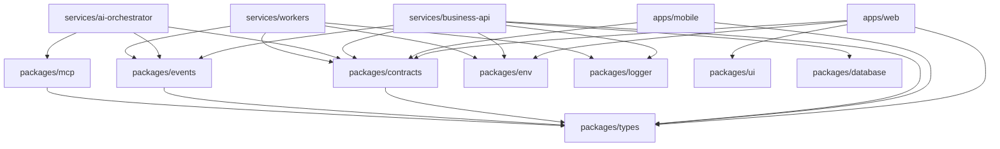

# Dependency Graph

```mermaid
flowchart TD
  Web["apps/web"]
  Mobile["apps/mobile"]
  BusinessApi["services/business-api"]
  AiOrchestrator["services/ai-orchestrator"]
  Workers["services/workers"]
  Contracts["packages/contracts"]
  Events["packages/events"]
  MCP["packages/mcp"]
  Types["packages/types"]
  Env["packages/env"]
  Logger["packages/logger"]
  UI["packages/ui"]
  Database["packages/database"]

  Web --> Contracts
  Web --> Types
  Web --> UI
  Web --> Env

  Mobile --> Contracts
  Mobile --> Types

  BusinessApi --> Contracts
  BusinessApi --> Events
  BusinessApi --> Types
  BusinessApi --> Env
  BusinessApi --> Logger
  BusinessApi --> Database

  AiOrchestrator --> Contracts
  AiOrchestrator --> Events
  AiOrchestrator --> MCP

  Workers --> Events
  Workers --> Contracts
  Workers --> Env
  Workers --> Logger

  Contracts --> Types
  Events --> Types
  MCP --> Types
```
