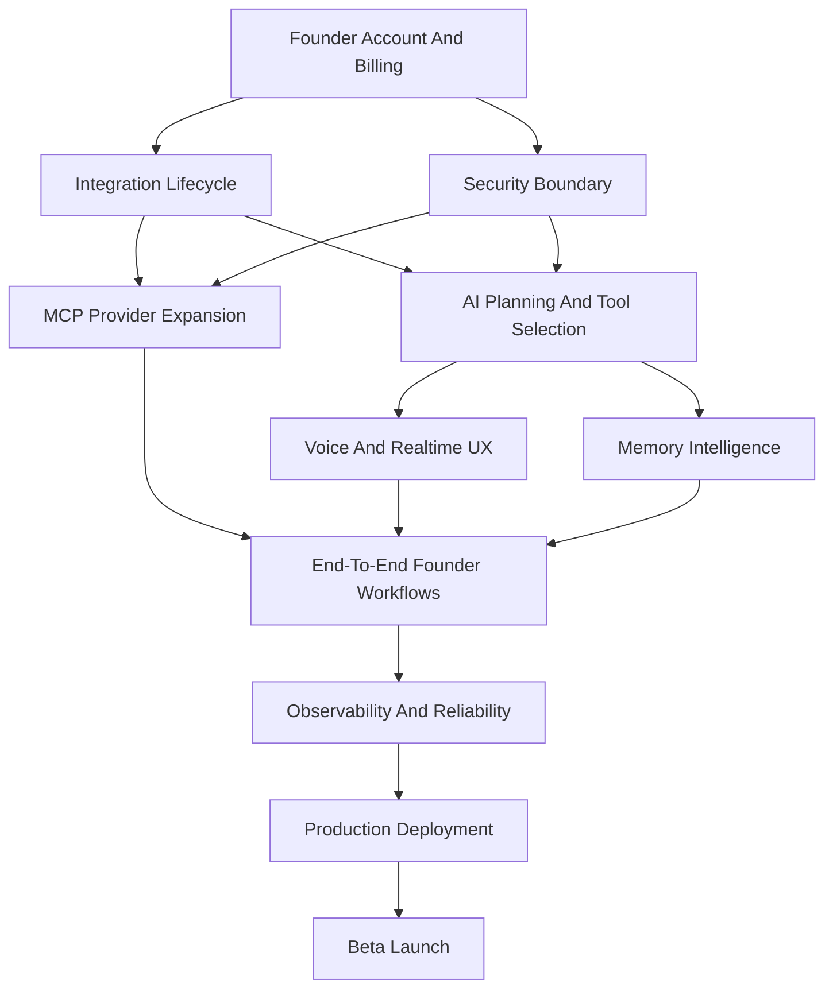

# FAIOS 100 Percent Implementation Plan

## Purpose

This document is the execution checklist for moving Founder AI Operating System from the current 50 percent platform foundation to a production-ready solo-founder AI SaaS.

FAIOS is not a team collaboration suite and does not require memberships for v1. The primary user is one founder who connects their tools, speaks or chats with the assistant, approves important actions, and lets the system execute work through MCP integrations.

## Product Definition For 100 Percent

FAIOS reaches 100 percent for v1 when a solo founder can:

- create and manage their founder account
- connect core external tools through secure OAuth or provider-approved setup
- speak or type commands
- have the AI plan multi-step work with memory and tool awareness
- approve risky actions before execution
- execute actions through real MCP adapters
- see live execution status, history, and results
- manage integrations, memory, preferences, and billing
- trust the platform with production-grade security, observability, reliability, and deployment practices

## Current Baseline

Already completed:

- Monorepo architecture with web, business API, AI orchestrator, workers, and shared packages.
- Founder-scoped command flow.
- MCP capability registry and adapter contract.
- GitHub issue creation adapter.
- Approval gate, RabbitMQ dispatch, worker execution, retries, redaction, and persisted invocations.
- LangGraph planning foundation with deterministic fallback.
- Memory repository and Qdrant boundary.
- Realtime execution stream.
- Voice input foundation.
- GitHub OAuth foundation.
- CI, runtime integration tests, Docker, Kubernetes base, and deployment smoke checklist.

Remaining work is now productization, provider expansion, security hardening, operational maturity, and release readiness.

## Guiding Engineering Rules

- Every feature must preserve the solo-founder product model.
- Every persisted record that belongs to a founder must be founder-scoped.
- Every external action must go through the MCP adapter contract.
- Every adapter must define capabilities, schemas, idempotency behavior, retry policy, redaction rules, and approval risk.
- Every sensitive workflow must produce audit events.
- Every provider payload stored in the database must be redacted first.
- Every schema change must use a formal migration.
- Every new runtime path must have contract tests or integration tests.
- Every externally callable endpoint must define validation, error semantics, observability, and rate limiting.
- The product should prefer voice-first speed, but every voice workflow must have a chat equivalent.

## Dependency Graph

## Milestone M9: Founder Account, Sessions, And Billing

Goal: make FAIOS a real SaaS account without adding team memberships.

### Implementation Checklist

- [ ] Add founder account model for production auth identity.
- [ ] Add session model with refresh-token rotation metadata.
- [ ] Add account recovery flow boundary.
- [ ] Add authenticated request middleware for Fastify.
- [ ] Add authenticated web route protection.
- [ ] Replace development founder shortcut with environment-gated dev fallback.
- [ ] Add founder account settings page.
- [ ] Add billing customer model.
- [ ] Add subscription model.
- [ ] Add plan entitlement model.
- [ ] Add usage counter model for commands, integrations, voice minutes, and AI calls.
- [ ] Add Stripe customer creation boundary.
- [ ] Add Stripe checkout session boundary.
- [ ] Add Stripe webhook verification boundary.
- [ ] Add subscription status sync.
- [ ] Add billing portal link boundary.
- [ ] Add tests for founder scoping, sessions, and entitlement checks.

### Acceptance Criteria

- A founder can sign in and operate only their own data.
- Development shortcuts are impossible in production configuration.
- Paid plan state can be read consistently by APIs and UI.
- Billing webhooks are signature-verified and idempotent.

## Milestone M10: Integration Lifecycle Platform

Goal: make integrations manageable, inspectable, renewable, and safe.

### Implementation Checklist

- [ ] Add integration catalog endpoint from the MCP registry.
- [ ] Add connection status endpoint per provider.
- [ ] Add OAuth success page.
- [ ] Add OAuth error page.
- [ ] Add provider reconnect flow.
- [ ] Add provider disconnect flow.
- [ ] Add provider credential rotation flow.
- [ ] Add token refresh support to integration credentials.
- [ ] Add provider health check contract.
- [ ] Add provider permission summary model.
- [ ] Add integration settings UI.
- [ ] Add connection test action.
- [ ] Add expired-token handling in workers.
- [ ] Add audit events for connect, refresh, disconnect, and failed execution.
- [ ] Add integration lifecycle tests with encrypted credentials.

### Acceptance Criteria

- A founder can connect, inspect, reconnect, and disconnect every supported provider.
- Workers never execute with expired credentials without attempting a safe refresh.
- Failed connections show a clear, actionable UI state.

## Milestone M11: Real AI Planning And Model Operations

Goal: replace scaffolded planning behavior with production-grade model orchestration.

### Implementation Checklist

- [ ] Implement OpenAI model provider.
- [ ] Implement Anthropic model provider.
- [ ] Implement Gemini model provider.
- [ ] Add model routing configuration.
- [ ] Add provider fallback policy.
- [ ] Add prompt template registry.
- [ ] Add prompt versioning.
- [ ] Add structured output validation with repair attempts.
- [ ] Add planner evaluation dataset.
- [ ] Add regression eval runner.
- [ ] Add capability-aware tool selection node.
- [ ] Add memory-context ranking node.
- [ ] Add approval-policy reasoning node.
- [ ] Add model timeout and retry policy.
- [ ] Add token usage accounting.
- [ ] Add model cost estimation.
- [ ] Add planner trace persistence with redaction.
- [ ] Add tests for malformed model output, provider outage, and tool mismatch.

### Acceptance Criteria

- Planner output is schema-valid before execution.
- Provider outages degrade through configured fallbacks.
- Prompt changes can be evaluated before release.
- AI traces are useful for debugging without storing raw secrets or sensitive provider payloads.

## Milestone M12: Streaming Voice Experience

Goal: make voice the fastest interaction path, not a demo-only input mode.

### Implementation Checklist

- [ ] Add browser audio capture using MediaRecorder.
- [ ] Add streaming audio upload endpoint or WebSocket channel.
- [ ] Add speech-to-text provider interface.
- [ ] Implement production speech provider.
- [ ] Add partial transcript events.
- [ ] Add transcript finalization event.
- [ ] Add transcript-to-command handoff.
- [ ] Add voice status UI states.
- [ ] Add retry and cancellation controls.
- [ ] Add microphone permission handling.
- [ ] Add optional text-to-speech response boundary.
- [ ] Add voice usage metering.
- [ ] Add tests for audio upload validation and transcript handoff.

### Acceptance Criteria

- A founder can dictate a command and see a validated transcript become a command.
- Voice failures fall back cleanly to chat input.
- Voice usage can be metered for billing and abuse prevention.

## Milestone M13: Memory Intelligence

Goal: make FAIOS remember useful context while remaining controllable and privacy-conscious.

### Implementation Checklist

- [ ] Add embedding provider interface.
- [ ] Implement production embedding provider.
- [ ] Add Qdrant collection migration job.
- [ ] Add semantic memory write path.
- [ ] Add semantic memory retrieval path.
- [ ] Add memory ranking and deduplication.
- [ ] Add memory confidence scores.
- [ ] Add memory source references.
- [ ] Add memory editing UI.
- [ ] Add memory deletion UI.
- [ ] Add data retention policy for memory.
- [ ] Add memory export path.
- [ ] Add memory redaction tests.
- [ ] Add retrieval quality evals.

### Acceptance Criteria

- The planner retrieves relevant founder and company context for commands.
- The founder can inspect, edit, delete, and export memory.
- Sensitive data is redacted before memory storage when policy requires it.

## Milestone M14: MCP Provider Expansion

Goal: support the first production-grade provider set for founders.

### Provider Order

1. GitHub breadth expansion
2. Google Calendar
3. Gmail
4. Slack
5. Notion
6. Jira or ClickUp
7. WhatsApp Business

### Shared Adapter Checklist

- [ ] Define provider capabilities.
- [ ] Define request and response schemas.
- [ ] Define action risk levels.
- [ ] Define approval requirements.
- [ ] Define idempotency keys.
- [ ] Define retry policy.
- [ ] Define rate-limit handling.
- [ ] Define payload redaction rules.
- [ ] Define credential requirements.
- [ ] Add fake provider for tests.
- [ ] Add contract tests.
- [ ] Add one founder-facing workflow smoke test.

### Provider-Specific Checklist

- [ ] Expand GitHub to search repositories, list issues, create issues, comment, and summarize repository state.
- [ ] Add Google Calendar read, create event, reschedule event, and availability lookup.
- [ ] Add Gmail search, summarize thread, draft reply, and send-with-approval.
- [ ] Add Slack search, summarize channel, draft message, and send-with-approval.
- [ ] Add Notion search, page creation, task/database item creation, and summary.
- [ ] Add Jira or ClickUp issue search, create task, update status, and comment.
- [ ] Add WhatsApp Business message drafting and send-with-approval.

### Acceptance Criteria

- Each adapter can be added without changing core execution code.
- Risky write/send actions require approval.
- Provider failures are visible, retry-safe, and redacted.

## Milestone M15: Founder Product UX

Goal: make the product coherent, fast, and trustworthy for daily founder use.

### Implementation Checklist

- [ ] Add first-run onboarding.
- [ ] Add integration setup checklist.
- [ ] Add command history page.
- [ ] Add command detail page.
- [ ] Add execution detail page.
- [ ] Add approval inbox improvements.
- [ ] Add approval diff and payload summary views.
- [ ] Add command retry flow.
- [ ] Add command cancellation flow.
- [ ] Add settings page.
- [ ] Add billing page.
- [ ] Add memory management page.
- [ ] Add empty, loading, error, and offline states.
- [ ] Add responsive layout polish.
- [ ] Add accessibility pass.
- [ ] Add keyboard-friendly command input.
- [ ] Add mobile web QA plan.

### Acceptance Criteria

- A founder can understand what the assistant did, what it needs, and what failed.
- Approval decisions are fast but informed.
- The web app is usable on desktop and mobile web.

## Milestone M16: Security, Privacy, And Compliance

Goal: make the platform trustworthy enough for real founder data.

### Implementation Checklist

- [ ] Write threat model.
- [ ] Add route-level rate limiting.
- [ ] Add command-level abuse controls.
- [ ] Add CORS policy.
- [ ] Add CSRF protection where cookie auth is used.
- [ ] Add webhook signature verification for every provider webhook.
- [ ] Add encrypted secret rotation plan.
- [ ] Add audit log persistence.
- [ ] Add data retention policy.
- [ ] Add founder data export.
- [ ] Add founder data deletion.
- [ ] Add privacy policy implementation checklist.
- [ ] Add security headers.
- [ ] Add dependency vulnerability scanning.
- [ ] Add container scanning.
- [ ] Add secret scanning.
- [ ] Add access logging with redaction.
- [ ] Add production incident response runbook.

### Acceptance Criteria

- Sensitive data handling is documented, enforced, and tested.
- Security checks run in CI.
- Founder data can be exported and deleted.

## Milestone M17: Observability, Reliability, And Operations

Goal: make FAIOS operable under production traffic.

### Implementation Checklist

- [ ] Add OpenTelemetry tracing.
- [ ] Add metrics exporter.
- [ ] Add structured log correlation across web, API, orchestrator, and workers.
- [ ] Add dashboard definitions.
- [ ] Add alert rules.
- [ ] Add SLO definitions.
- [ ] Add RabbitMQ dead-letter queue handling.
- [ ] Add retry exhaustion workflow.
- [ ] Add worker concurrency controls.
- [ ] Add backpressure controls.
- [ ] Add database backup plan.
- [ ] Add database restore drill.
- [ ] Add Qdrant backup plan.
- [ ] Add Redis persistence policy.
- [ ] Add runbooks for provider outage, queue buildup, database outage, and model outage.
- [ ] Add load testing scenario.
- [ ] Add failure injection tests.

### Acceptance Criteria

- Operators can identify failures quickly.
- Queue, model, provider, and database issues have defined recovery paths.
- Performance limits are known before launch.

## Milestone M18: Production Deployment

Goal: deploy the system predictably and safely.

### Implementation Checklist

- [ ] Verify all production Docker images build.
- [ ] Add Kubernetes environment overlays.
- [ ] Add ingress configuration.
- [ ] Add TLS configuration.
- [ ] Add resource requests and limits.
- [ ] Add horizontal pod autoscaling.
- [ ] Add pod disruption budgets.
- [ ] Add migration job.
- [ ] Add secret manager integration plan.
- [ ] Add deployment rollback plan.
- [ ] Add production smoke test.
- [ ] Add staging environment.
- [ ] Add release promotion checklist.
- [ ] Add infrastructure documentation.

### Acceptance Criteria

- Staging and production deployments use repeatable manifests.
- Migrations run safely before app rollout.
- Rollback is documented and tested.

## Milestone M19: End-To-End Workflow Catalog

Goal: ship a practical set of founder workflows that prove the OS value.

### Workflow Checklist

- [ ] Create GitHub issue from voice.
- [ ] Summarize GitHub repository status.
- [ ] Find calendar availability and schedule a meeting.
- [ ] Summarize unread founder emails.
- [ ] Draft and approve an email reply.
- [ ] Summarize Slack channel context.
- [ ] Draft and approve a Slack update.
- [ ] Create a Notion planning page.
- [ ] Create a Jira or ClickUp task from a founder command.
- [ ] Draft and approve a WhatsApp Business message.
- [ ] Use memory to personalize a follow-up.
- [ ] Recover gracefully when an integration is disconnected.

### Acceptance Criteria

- Each workflow has a demo script, automated test coverage, and clear failure behavior.
- The founder can complete daily operating tasks faster than opening each tool manually.

## Milestone M20: Release Quality And Beta Launch

Goal: prepare FAIOS for real beta users.

### Implementation Checklist

- [ ] Add Playwright end-to-end tests.
- [ ] Add API contract tests.
- [ ] Add provider contract tests.
- [ ] Add AI eval regression tests.
- [ ] Add performance test baseline.
- [ ] Add accessibility test baseline.
- [ ] Add release checklist.
- [ ] Add beta onboarding guide.
- [ ] Add feedback capture workflow.
- [ ] Add support escalation workflow.
- [ ] Add changelog process.
- [ ] Add versioning policy.
- [ ] Add product analytics events with privacy review.
- [ ] Add launch readiness review.

### Acceptance Criteria

- Release can be repeated without tribal knowledge.
- Beta feedback can be captured and converted into prioritized work.
- Critical workflows are covered by automated tests and manual smoke scripts.

## Cross-Cutting Definition Of Done

Every completed implementation slice must include:

- [ ] scoped plan or issue checklist
- [ ] formal migration when persistence changes
- [ ] shared contract update when API or event shapes change
- [ ] typed validation at service boundaries
- [ ] redaction for logs and stored provider payloads
- [ ] audit event for sensitive actions
- [ ] unit tests for local logic
- [ ] integration tests for runtime behavior
- [ ] UI states for loading, success, empty, and error paths when user-facing
- [ ] documentation update
- [ ] `pnpm format:check`
- [ ] `pnpm lint`
- [ ] `pnpm typecheck`
- [ ] `pnpm test`
- [ ] relevant build or smoke command
- [ ] commit and push after the slice is complete

## Execution Order From Here

1. M9 Founder Account, Sessions, And Billing
2. M10 Integration Lifecycle Platform
3. M11 Real AI Planning And Model Operations
4. M12 Streaming Voice Experience
5. M13 Memory Intelligence
6. M14 MCP Provider Expansion
7. M15 Founder Product UX
8. M16 Security, Privacy, And Compliance
9. M17 Observability, Reliability, And Operations
10. M18 Production Deployment
11. M19 End-To-End Workflow Catalog
12. M20 Release Quality And Beta Launch

## First Next Implementation Slice

The next engineering slice should be M9.1: production-shaped founder account and session boundary.

### M9.1 Checklist

- [x] Add founder auth identity tables.
- [x] Add session tables.
- [x] Add Prisma migration.
- [x] Add Fastify auth middleware.
- [x] Add request context tests.
- [x] Keep development fallback behind explicit non-production config.
- [x] Add web auth client boundary without implementing final login screens.
- [x] Update docs and environment examples.

### M9.1 Completion Gate

- `pnpm format:check`
- `pnpm lint`
- `pnpm typecheck`
- `pnpm test`
- Prisma migration validation

## Second Next Implementation Slice

M9.2 adds founder account/profile management and session lifecycle controls without implementing login screens.

### M9.2 Checklist

- [x] Add founder account read API.
- [x] Add founder account update API.
- [x] Add founder profile update boundary.
- [x] Add company profile update boundary.
- [x] Add founder session list API.
- [x] Add founder-owned session revoke API.
- [x] Add shared contracts for account and session management.
- [x] Add web account settings boundary.
- [x] Add account/session management integration tests.

### M9.2 Completion Gate

- `pnpm format:check`
- `pnpm lint`
- `pnpm typecheck`
- `pnpm test`
- `pnpm build`
- `pnpm --filter @faios/business-api test:integration`

## Third Next Implementation Slice

M9.3 adds the billing and entitlement foundation needed before real Stripe checkout and webhook flows.

### M9.3 Checklist

- [x] Add billing customer model.
- [x] Add subscription model.
- [x] Add plan entitlement model.
- [x] Add usage counter model.
- [x] Add formal Prisma migration.
- [x] Add shared billing status contracts.
- [x] Add authenticated billing status API.
- [x] Add web billing status boundary.
- [x] Add billing foundation integration tests.

### M9.3 Completion Gate

- `pnpm --filter @faios/database prisma:generate`
- Prisma migration deploy validation
- `pnpm format:check`
- `pnpm lint`
- `pnpm typecheck`
- `pnpm test`
- `pnpm build`
- `pnpm --filter @faios/business-api test:integration`

## Fourth Next Implementation Slice

M9.4 adds Stripe checkout, billing portal, and verified webhook synchronization boundaries.

### M9.4 Checklist

- [x] Add billing webhook event idempotency model.
- [x] Add formal Prisma migration.
- [x] Add checkout session contracts.
- [x] Add billing portal session contracts.
- [x] Add Stripe customer creation boundary.
- [x] Add Stripe checkout session boundary.
- [x] Add Stripe billing portal boundary.
- [x] Add Stripe webhook signature verification.
- [x] Add idempotent subscription webhook sync.
- [x] Add web checkout and portal actions.
- [x] Add Stripe boundary integration tests.
- [x] Update environment examples.

### M9.4 Completion Gate

- `pnpm --filter @faios/database prisma:generate`
- Prisma migration deploy validation
- `pnpm format:check`
- `pnpm lint`
- `pnpm typecheck`
- `pnpm test`
- `pnpm build`
- `pnpm --filter @faios/business-api test:integration`

## Fifth Next Implementation Slice

M10.1 starts the integration lifecycle platform with catalog and provider status/readiness APIs.

### M10.1 Checklist

- [x] Add integration catalog contracts.
- [x] Add provider status/readiness contracts.
- [x] Add business API credential resolver for MCP readiness.
- [x] Add integration catalog use case.
- [x] Add provider status use case.
- [x] Add catalog endpoint.
- [x] Add provider status endpoint.
- [x] Add web integration catalog client boundary.
- [x] Add web integration catalog panel.
- [x] Add integration catalog/status regression test.

### M10.1 Completion Gate

- `pnpm format:check`
- `pnpm lint`
- `pnpm typecheck`
- `pnpm test`
- `pnpm build`
- `pnpm --filter @faios/business-api test:integration`

## Sixth Next Implementation Slice

M10.2 adds founder-controlled integration lifecycle transitions and credential rotation.

### M10.2 Checklist

- [x] Add integration lifecycle database fields.
- [x] Add integration lifecycle audit event model.
- [x] Add formal Prisma migration.
- [x] Add shared contracts for disconnect, reconnect, and credential rotation.
- [x] Add provider disconnect use case and API route.
- [x] Add provider reconnect use case and API route.
- [x] Add GitHub credential rotation use case and API route.
- [x] Persist credential rotation timestamp and reason.
- [x] Keep encrypted provider credentials out of responses.
- [x] Add web lifecycle mutations and query invalidation.
- [x] Add GitHub panel disconnect, reconnect, and token rotation controls.
- [x] Add runtime integration test for connect, disconnect, reconnect, and rotate.

### M10.2 Completion Gate

- `pnpm --filter @faios/database prisma:generate`
- Prisma migration deploy validation
- `pnpm format:check`
- `pnpm lint`
- `pnpm typecheck`
- `pnpm test`
- `pnpm build`
- `pnpm --filter @faios/business-api test:integration`

## Seventh Next Implementation Slice

M10.3 adds provider health snapshots, permission summaries, and credential refresh/expiry safety boundaries.

### M10.3 Checklist

- [x] Add provider permission summary model.
- [x] Add credential expiry and refresh metadata fields.
- [x] Add formal Prisma migration.
- [x] Add shared health, permission summary, and refresh contracts.
- [x] Add explicit provider health-check API route.
- [x] Persist latest provider health status and message.
- [x] Persist coarse permission summaries without raw provider payloads.
- [x] Add manual-token credential refresh boundary.
- [x] Record audit events for health checks, permission checks, and refresh attempts.
- [x] Teach MCP adapters to surface credential unavailable reasons.
- [x] Deny worker execution for disconnected, unhealthy, and expired credentials.
- [x] Add integration UI health, permission, and test-connection states.
- [x] Add runtime coverage for lifecycle health, refresh metadata, and worker denials.

### M10.3 Completion Gate

- `pnpm --filter @faios/database prisma:generate`
- Prisma migration deploy validation
- `pnpm format:check`
- `pnpm lint`
- `pnpm typecheck`
- `pnpm test`
- `pnpm build`
- `pnpm --filter @faios/business-api test:integration`
- `pnpm --filter @faios/workers test:integration`

## Eighth Next Implementation Slice

M10.4 completes founder-facing GitHub OAuth result handling and hardens callback safety.

### M10.4 Checklist

- [x] Add web GitHub OAuth callback route.
- [x] Add GitHub OAuth success page.
- [x] Add GitHub OAuth error page.
- [x] Default GitHub OAuth redirect URI to the web callback.
- [x] Add web OAuth completion client boundary.
- [x] Add backend POST OAuth completion API route.
- [x] Keep existing GET OAuth callback route for compatibility.
- [x] Harden OAuth token exchange against non-JSON provider responses.
- [x] Add OAuth replay regression coverage.
- [x] Add wrong-founder OAuth state regression coverage.
- [x] Add expired-state OAuth regression coverage.
- [x] Add malformed token response regression coverage.

### M10.4 Completion Gate

- `pnpm format:check`
- `pnpm lint`
- `pnpm typecheck`
- `pnpm test`
- `pnpm build`
- `pnpm --filter @faios/business-api test:integration`

## Ninth Next Implementation Slice

M11.1 adds model-routing and structured-output safety while preserving deterministic fallback.

### M11.1 Checklist

- [x] Add typed AI orchestrator planner configuration.
- [x] Add model provider routing with timeout, retry, and ordered fallback.
- [x] Add OpenAI provider boundary.
- [x] Add Anthropic provider boundary.
- [x] Add Gemini provider boundary.
- [x] Add versioned planner prompt registry.
- [x] Add structured JSON output validation helper.
- [x] Add deterministic repair-or-fallback boundary.
- [x] Ensure invalid model output cannot bypass `PlanResponse` validation.
- [x] Wire FastAPI planning route to the configured model router.
- [x] Preserve deterministic fallback when providers are unavailable.
- [x] Add business API AI-orchestrator request timeout.
- [x] Add model routing and invalid-output regression tests.

### M11.1 Completion Gate

- `python -m ruff check .`
- `python -m pytest`
- `pnpm format:check`
- `pnpm lint`
- `pnpm typecheck`
- `pnpm test`
- `pnpm build`

## Tenth Next Implementation Slice

M11.2 adds planner regression evals for capability selection and approval behavior.

### M11.2 Checklist

- [x] Add planner evaluation dataset.
- [x] Add regression eval runner.
- [x] Add default capability fixture for evals.
- [x] Validate expected capability selection.
- [x] Validate expected approval status.
- [x] Add tests proving the eval dataset loads.
- [x] Add tests proving the deterministic planner passes the baseline evals.

### M11.2 Completion Gate

- `python -m ruff check .`
- `python -m pytest`
- `pnpm format:check`
- `pnpm lint`
- `pnpm typecheck`
- `pnpm test`
- `pnpm build`

## Eleventh Next Implementation Slice

M12.1 adds browser voice capture hardening for the founder command surface.

### M12.1 Checklist

- [x] Add explicit voice capture lifecycle states.
- [x] Request microphone access before capture starts.
- [x] Capture local audio chunks with `MediaRecorder`.
- [x] Maintain transcript state from browser speech recognition.
- [x] Add retry, cancel, and cleanup flows.
- [x] Show microphone/capture status in the founder command panel.
- [x] Submit completed transcripts as `source: "voice"` commands.

### M12.1 Completion Gate

- `pnpm format:check`
- `pnpm lint`
- `pnpm typecheck`
- `pnpm test`
- `pnpm build`

## Twelfth Next Implementation Slice

M13.1 adds founder-facing memory management with founder-scoped backend boundaries.

### M13.1 Checklist

- [x] Add shared contracts for memory list, update, delete, and export.
- [x] Add backend use cases for founder-scoped memory management.
- [x] Add safe repository projections that exclude vector refs and raw metadata.
- [x] Redact sensitive content before founder edits are stored.
- [x] Register memory management routes in the Business API.
- [x] Add web API client and React Query hooks.
- [x] Add founder memory management panel for list/edit/delete/export.
- [x] Add runtime integration coverage for founder isolation, redaction, export, and delete.

### M13.1 Completion Gate

- `pnpm format:check`
- `pnpm lint`
- `pnpm typecheck`
- `pnpm test`
- `pnpm build`
- `pnpm --filter @faios/business-api test:integration`

## Thirteenth Next Implementation Slice

M15.1 adds the founder console shell that organizes command, operations, integrations, memory, and settings into a production-facing dashboard.

### M15.1 Checklist

- [x] Replace the single stacked homepage with a dashboard shell.
- [x] Keep voice and command input as the first-viewport product focus.
- [x] Add sticky section navigation for repeated founder workflows.
- [x] Group approvals and execution history into an operations area.
- [x] Group GitHub connection, integration catalog, and capability readiness into an integrations area.
- [x] Mount founder memory management in its own dashboard section.
- [x] Keep account and billing controls in a settings area.
- [x] Preserve responsive layouts across mobile and wide desktop.

### M15.1 Completion Gate

- `pnpm format:check`
- `pnpm lint`
- `pnpm typecheck`
- `pnpm test`
- `pnpm build`

## Fourteenth Next Implementation Slice

M13.2 closes the remaining founder memory intelligence gaps: semantic search, import/restore, retention/archive, and merge/deduplication.

### M13.2 Checklist

- [x] Add memory import/restore contracts and APIs.
- [x] Add append and replace import modes with sensitive-content redaction.
- [x] Add semantic memory search contract, backend use case, and founder-facing web controls.
- [x] Add deterministic text vectors with Qdrant search when available and founder-scoped lexical fallback.
- [x] Add memory merge/dedup contracts, backend transaction, and web selection workflow.
- [x] Add archive/unarchive controls.
- [x] Convert delete into soft delete with retention metadata.
- [x] Add retention purge endpoint for expired deleted memory.
- [x] Add Prisma migration for memory lifecycle fields.
- [x] Extend runtime integration coverage for founder isolation, import, search, merge, archive, soft delete, and purge.

### M13.2 Completion Gate

- `pnpm format:check`
- `pnpm lint`
- `pnpm typecheck`
- `pnpm test`
- `pnpm build`
- `pnpm --filter @faios/database exec prisma migrate deploy --schema prisma/schema.prisma`
- `pnpm --filter @faios/business-api test:integration`

## Out Of Scope For V1

- Team workspaces.
- Member invitations.
- Role-based team permissions.
- Enterprise SSO.
- Native React Native app.
- Marketplace for third-party developers.
- Autonomous execution of high-risk actions without founder approval.
