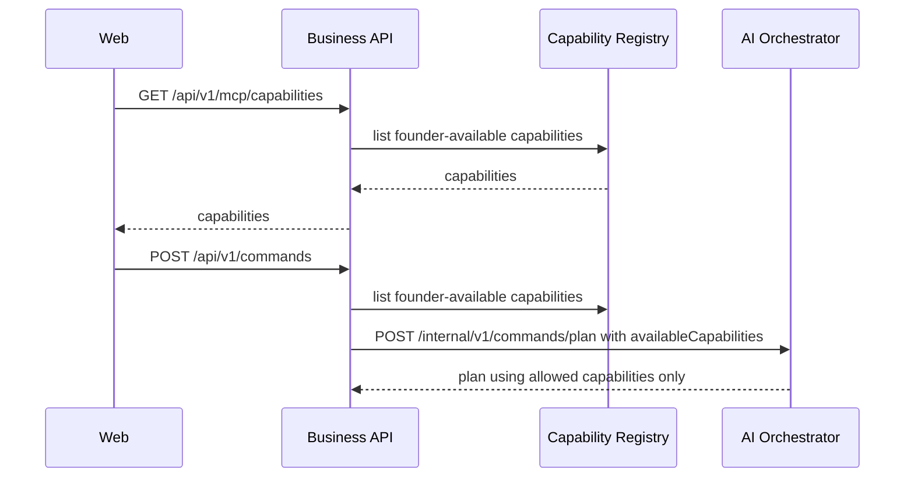

# MCP Capability Registry Implementation Plan

## Purpose

This plan defines the next platform slice after the Founder Command Pipeline: a registry of MCP capabilities that FAIOS can plan against before any real external tool execution exists.

The current mock planner infers capabilities from text. That is useful for the first vertical slice, but the platform needs a first-class source of truth for what a founder's assistant can do, which provider owns the capability, whether it requires approval, and whether it is available for the founder.

## Product Slice

```text
System seed capabilities
  -> Business API exposes available capabilities
  -> Web app shows capability readiness
  -> AI Orchestrator accepts available capabilities during planning
  -> Planner selects only registered capabilities
```

## Non-Goals

- No OAuth implementation
- No real MCP server connection
- No provider API calls
- No tool invocation execution
- No marketplace UI
- No custom founder-created capabilities

## Success Criteria

- The system has a typed MCP capability contract.
- Default MVP capabilities are seeded or returned deterministically.
- Business API exposes `GET /api/v1/mcp/capabilities`.
- Business API includes available capabilities when calling the AI planner.
- AI Orchestrator planner restricts selected steps to supplied capabilities.
- Web app displays available capabilities near the command composer.
- Checks pass.

## Initial MVP Capabilities

| Capability               | Default Provider  | Approval | Purpose                               |
| ------------------------ | ----------------- | -------- | ------------------------------------- |
| `calendar.schedule`      | `google-calendar` | Yes      | Schedule meetings and calendar events |
| `communication.send`     | `gmail`           | Yes      | Draft or send outbound messages       |
| `task.create`            | `jira`            | No       | Create tasks/issues in work tools     |
| `knowledge.search`       | `notion`          | No       | Search founder/company knowledge      |
| `repository.createIssue` | `github`          | No       | Create repository issues              |

## Architecture



## Data Model

Use existing `IntegrationConnection.capabilityKeys` for founder/provider availability in later phases.

For this phase:

- Keep the registry deterministic and code-backed.
- Do not require database records for capabilities.
- Return default capabilities for the development founder.
- Make the API shape compatible with future provider-backed state.

Future database-backed model can add:

- `CapabilityDefinition`
- `FounderCapability`
- `CapabilityProviderBinding`

Do not add these tables yet unless they are needed by implementation.

## Shared Contracts

Add to `@faios/contracts`:

- `mcpCapabilitySchema`
- `listCapabilitiesResponseSchema`
- `availableCapabilities` on planner request

Required fields:

- `key`
- `provider`
- `label`
- `description`
- `requiresApproval`
- `status`

Statuses:

- `available`
- `not_connected`
- `disabled`

## Business API

Expected folders:

```text
services/business-api/src/features/mcp-capabilities/
  application/
    list-capabilities.use-case.ts
  infrastructure/
    capability-registry.ts
  presentation/
    mcp-capability.routes.ts
  index.ts
```

Endpoint:

```http
GET /api/v1/mcp/capabilities
```

Response:

```json
{
  "capabilities": [
    {
      "key": "calendar.schedule",
      "provider": "google-calendar",
      "label": "Schedule calendar events",
      "description": "Prepare meetings and calendar changes.",
      "requiresApproval": true,
      "status": "available"
    }
  ]
}
```

Command pipeline change:

- `CreateCommandUseCase` should list available capabilities.
- It should pass them to `AiOrchestratorClient.planCommand`.

## AI Orchestrator

Planner request should accept:

```json
{
  "availableCapabilities": [
    {
      "key": "calendar.schedule",
      "provider": "google-calendar",
      "requiresApproval": true
    }
  ]
}
```

Planner behavior:

- Match command text against known capability keywords.
- Filter matches to supplied `availableCapabilities`.
- If no supplied capability matches, fall back to available `knowledge.search` if present.
- If nothing is available, return a failed or empty plan response without executing anything.

## Web App

Add a compact capability panel near the command composer:

- Show provider
- Show approval marker
- Show status
- Keep it operational, not explanatory

Use TanStack Query:

```text
apps/web/src/features/commands/hooks/use-capabilities.ts
```

## Reliability

- Capability registry must be deterministic.
- Unknown capability keys must not be sent to the AI planner.
- Planner must never produce steps outside the allowed capability list.
- Missing capability state must fail closed.

## Security

- Capabilities are not credentials.
- Do not expose OAuth tokens.
- Do not imply a provider is connected unless status is `available`.
- Approval-required capabilities must keep `requiresApproval=true` from registry to plan.

## Testing

Required checks:

- Contract typecheck
- Business API typecheck/lint
- AI Orchestrator compile/smoke
- Web typecheck/lint/build
- Full monorepo checks

Runtime smoke when Docker is available:

1. Start Postgres.
2. Push Prisma schema.
3. Start AI Orchestrator.
4. Start Business API.
5. `GET /api/v1/mcp/capabilities`.
6. `POST /api/v1/commands`.
7. Verify returned plan steps are drawn from listed capabilities.

## Implementation Order

1. Update shared contracts.
2. Add Business API capability registry and route.
3. Pass capabilities into planner request.
4. Update AI Orchestrator schemas and filtering.
5. Add web capability query and panel.
6. Run checks.
7. Commit and push each completed phase.

## Acceptance Checklist

- [ ] Capability contracts exist.
- [ ] `GET /api/v1/mcp/capabilities` exists.
- [ ] Command planning receives available capabilities.
- [ ] AI planner filters to available capabilities.
- [ ] Web app displays capability readiness.
- [ ] No OAuth or real MCP execution is introduced.
- [ ] Checks pass.
